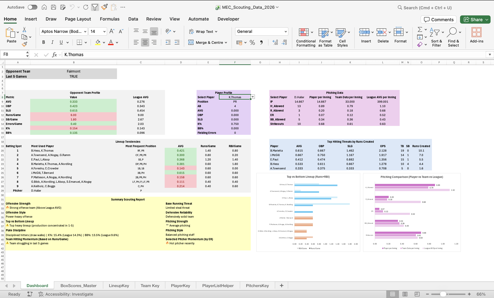
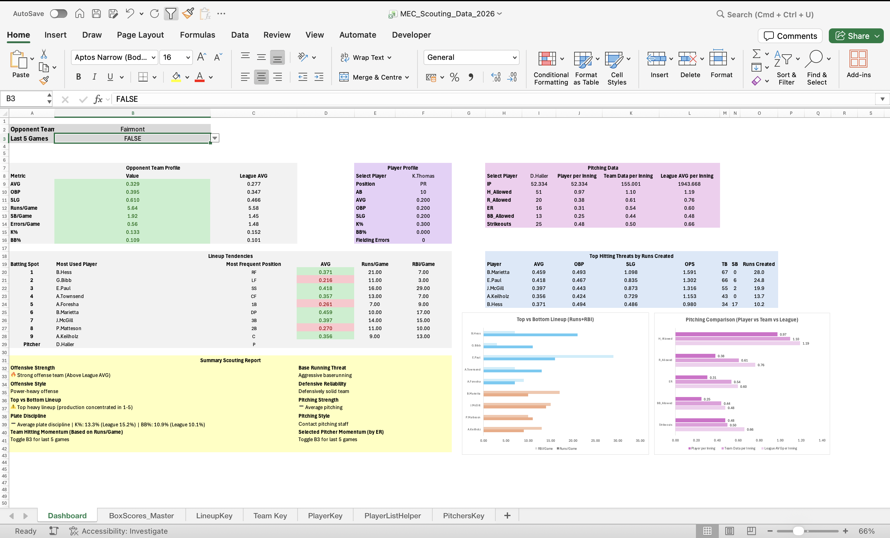

# Lauren Tate – Data Analytics Portfolio

## Projects

### College Softball Scouting Dashboard (MEC_Scouting_Dashboard)
- Excel-based scouting and lineup analysis dashboard  
- Features lineup tendencies, position analysis, and last 5 games toggle  
- Built using dynamic formulas and structured game-level data  
- 📂 Files: MEC_Scouting_Data_2026.xlsx
## MEC Scouting Dashboard Preview

### COVID-19 SQL Project
- SQL analysis of COVID-19 data  
- Focus on trends, cases, and deaths  
- 📂 Files: COVID 19 Project.sql  

### Nashville Housing Data Cleaning Project
- Data cleaning and transformation using SQL  
- Addressed missing values, formatting, and standardization  
- 📂 Files: Data Cleaning Project_NashvilleHousing.sql  

### NBA Salary & Performance Analysis
- Python-based analysis of salary vs performance  
- 📂 File: NBA Salary & Performance Data.ipynb  

### NFL Injury Research Paper
- Academic research on injury trends and impacts  
- 📂 File: Injuries in the NFL Research Paper.pdf  

### Additional Projects
- Movie Correlation Analysis (Python)  
- Concussion Dataset Analysis (R)  

## Tools & Skills
- Excel (dashboards, formulas, data modeling)  
- SQL (data cleaning, querying)  
- Python (pandas, analysis, visualization)  
- R (statistical analysis)  
- Data visualization and storytelling  

## About This Portfolio
This repository contains a collection of data analytics projects focused on sports analytics, healthcare data, and business datasets. Each project demonstrates data cleaning, analysis, and visualization skills across multiple tools and languages.
